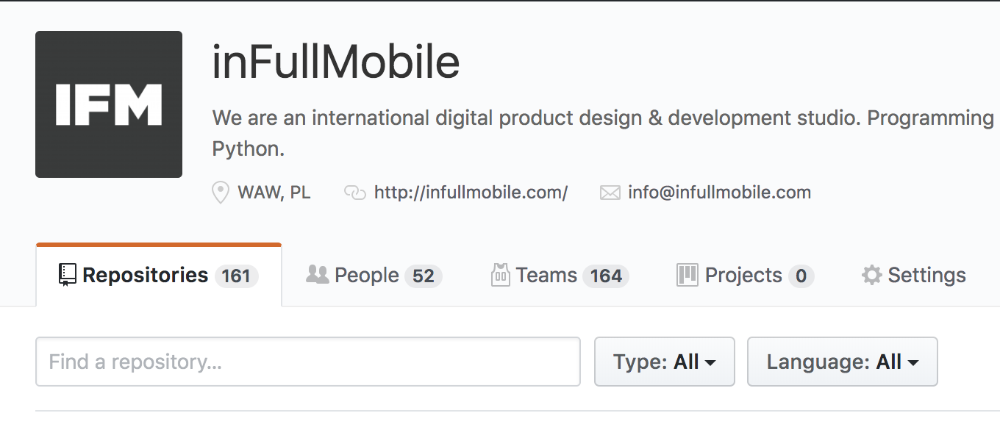
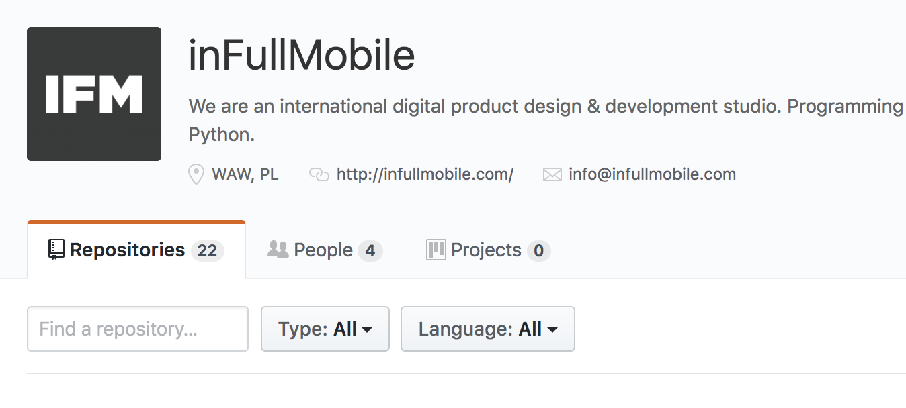
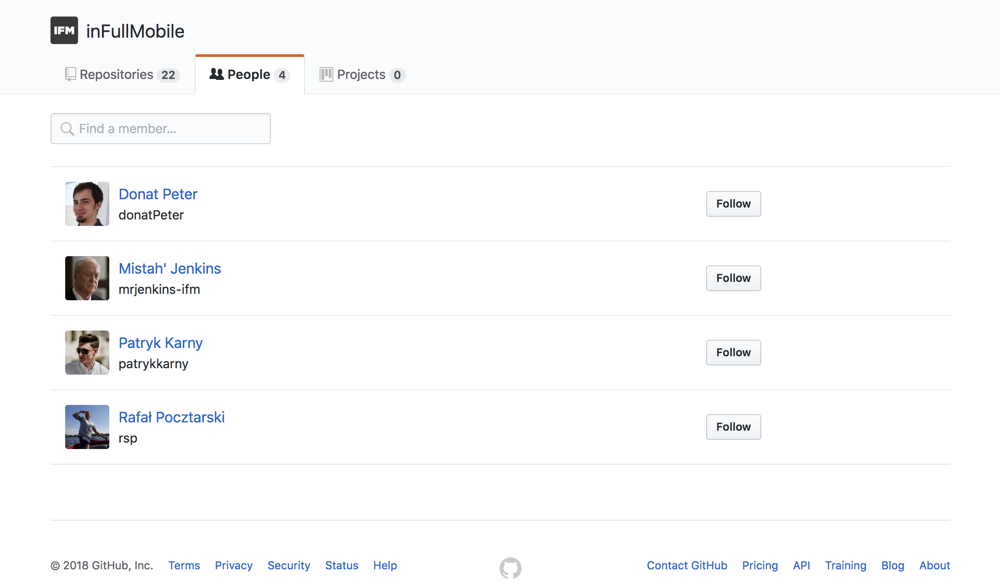
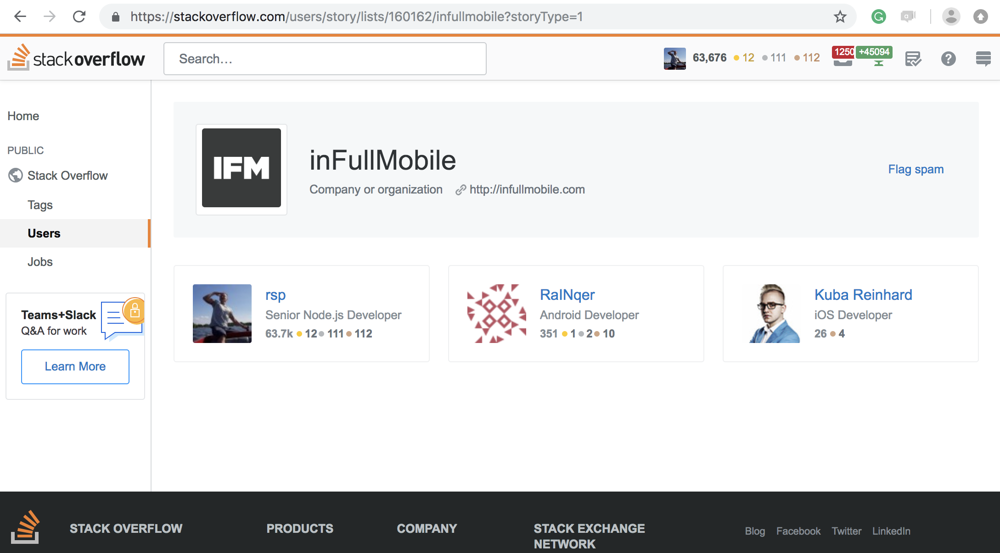
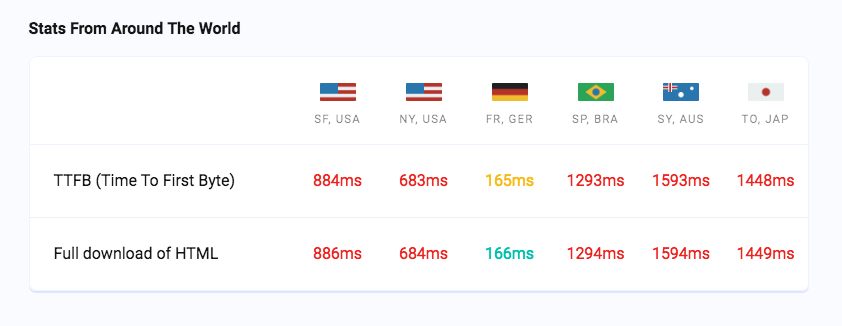
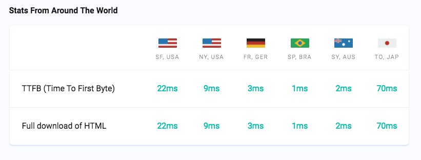

inFullAPI

November 2018 Hackathon

iFM Promotional Stunt

---

But first, since we are on the topic of promotion...

---

This is how we see ourselves on GitHub:

---

This is how other people see us on GitHub:

---

Who are those brave 4 who don't hide that they work here?

---

---

It's even worse on Stack Overflow.

Only 3 people have ever admitted working at inFullMobile.

---

---

Now back to the hackathon.

---

Hackathon theme: iFM Promotional Stunt

A good promotional stunt would be to:

1. have a *fast* website and blog about its speed
2. use *modern* technologies and blog about it
3. make it easy to try new designs and technologies
4. make a periodical contest for a better website

---

Problem #1:

infullmobile.com website is sloooooow.

(*Especially* when accessed from the US.
Not a problem if we don't look for clients there.
Unfortunately we do.)

---

Problem #2:

It's hard to optimize because we're using WordPress.

---

Problem #3:

It's hard to show off our mad skills since our website
is powered by PHP ("Personal Home Page") using ready-made 
not written by us.

---

Some numbers

---

**5+ seconds** (not milliseconds!) load time on WebPageTest

- First Byte Time: F grade
- Cache static content: F grade
- Effective use of CDN: No

<small>https://www.webpagetest.org/result/181121_86_dad9bcf684a911aee2353d6d98c463a1/</small>

---

**3/100** score on testmysite.io

- Slow TTFB (Time To First Byte)
- Slow loading HTML
- HTTP2 not enabled

<small>https://testmysite.io/5bf530f7e39e7c78ae0e09e4/infullmobile.com</small>

---

<small>https://testmysite.io/5bf530f7e39e7c78ae0e09e4/infullmobile.com</small>

---

<small>https://www.webpagetest.org/result/181121_WZ_b79026bbf061ef6b5b648bb8083e9dde/</small>

---

HTML load time (no images and no rendering)

<small>(stats for the production website of inFullMobile)</small>

<small>https://testmysite.io/5bf530f7e39e7c78ae0e09e4/infullmobile.com</small>

---

It should be:

<small>(stats for the development website of BookVenyou)</small>

<small>https://testmysite.io/5bf537a4b3127472b90dbbb2/bv-web-develop.netlify.com</small>

---

What can we do:

- Use modern technologies
- Expose all data with an API
- Build a Static/JAMstack website
- Use good hosting with CDN

---

Advantages:

- We'll be up-to-date with modern technologies
- Clients will see that we can build fast systems
- Easy to build new website prototypes
- Easy to create a company mobile app

---

We'll have good recruitment tasks:

  - create a website using the API
  - create a mobile app using the API

---

We'll be able to say that even our website is built
with the best technology we could find.

---

What is **JAM**stack

- client-side __J__avaScript
- reusable __A__PIs
- prebuilt __M__arkup

---

How can we incrementally achieve the goal:

1. Use a headless CMS
2. Migrate data from WordPress
3. Create a static website based on the current HTML
4. Populate it with the data from the new CMS via API
5. Incrementally improve the website
6. Create new website versions

---

What's a headless CMS?

Something like WordPress admin panel but without the website.

It decouples the content authoring process from the
frontend implementation.

---

Headless CMS works like this:

- a convenient UI is used to easily edit content
- all the data is exposed via API to the frontend

---

We can switch the frontend:

  - without changing the authoring process
  - without exporting/importing existing content

---

The frontend can be:

- a custom website in vanilla JS
- a single-page application (SPA)
- it can be rendered client-side or server-side
- it can use Angular, React, Vue, Ember, Aurelia...
- it can use a static site generator

---

Tech stack

---

Headless CMS - hosted:

- Contentful - https://www.contentful.com/
- Prismic - https://prismic.io/
- GatherContent - https://gathercontent.com/
- ButterCMS - https://buttercms.com/
- TakeShape - https://www.takeshape.io/
- Kentico Cloud - https://kenticocloud.com/
- Netlify CMS - https://www.netlifycms.org/

---

Note:

Contentful is used in one of our commercial projects.

Client is familiar with that and it was a requirement but none of us had any prior experience.

It would be safer to learn those tools on internal projects.

---

Headless CMS - installed:

- Strapi - https://strapi.io/
- KeystoneJS - https://keystonejs.com/

---

Static site generators:

- Jekyll - https://jekyllrb.com/
- Next - https://nextjs.org/
- Gatsby - https://www.gatsbyjs.org/
- Hexo - https://hexo.io/
- VuePress - https://vuepress.vuejs.org/

Much more at: https://www.staticgen.com/

---

Static content handling and asset conversion:

- Cloudinary - https://cloudinary.com/
- Uploadcare - https://uploadcare.com/
- Filestack - https://www.filestack.com/

---

Static hosting and CDN:

- Netlify - https://www.netlify.com/

I didn't find anything better yet.

We already use it.

---

Why this presentation is called inFullAPI?

Because I started with creating a simple API
exposing some of the content used on the website.

The idea was to have all the data in a custom database.

---

It would not be convenient for non-developers so
I started exploring tools to make the process
of content authoring easier and more convenient.

Using a headless CMS seems like the way to go.

---

Thank you

---

Slides:

[pocztarski.com/ifa](https://pocztarski.com/ifa)

---
 
