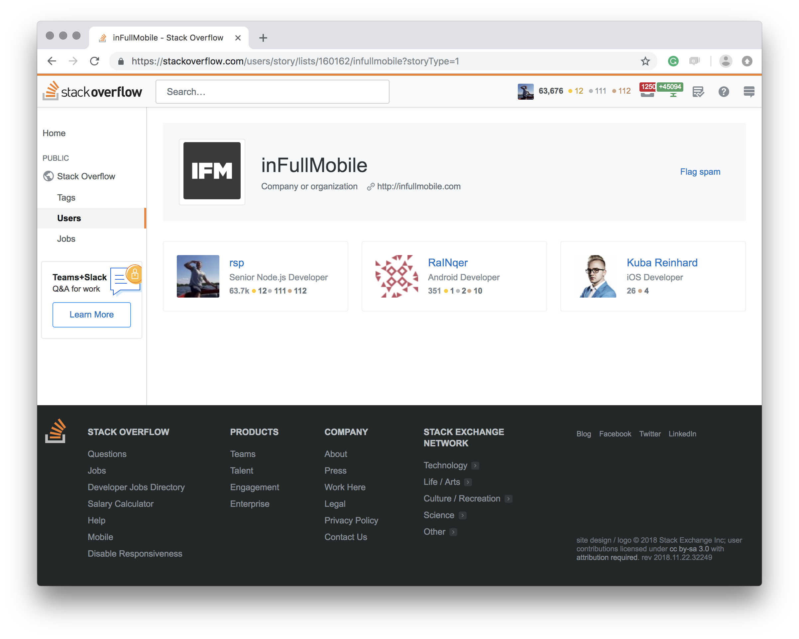

# inFullApi

Hackathon

---

But first...

---

This is how we see ourselves on GitHub:

---

This is how other people see us on GitHub:

---

Who are those brave 4?

---

---

This is how other people see us on Stack Overflow:

https://stackoverflow.com/users/story/lists/160162/infullmobile?storyType=1

---

Now back to the hackathon.

---

Problem:

infullmobile.com website is sloooooow

Especially when accessed from the US

---

**5+ seconds** (not milliseconds!) load time on WebPageTest

- First Byte Time: F grade
- Cache static content: F grade
- Effective use of CDN: No

<small>https://www.webpagetest.org/result/181121_86_dad9bcf684a911aee2353d6d98c463a1/</small>

---

**3/100** score on testmysite.io

- Slow TTFB (Time To First Byte)
- Slow loading HTML
- HTTP2 not enabled

<small>https://testmysite.io/5bf530f7e39e7c78ae0e09e4/infullmobile.com</small>

---

<small>https://testmysite.io/5bf530f7e39e7c78ae0e09e4/infullmobile.com</small>

---

<small>https://www.webpagetest.org/result/181121_WZ_b79026bbf061ef6b5b648bb8083e9dde/</small>

---

HTML load time (no images and no rendering)

<small>(stats for the production website of inFullMobile)</small>

<small>https://testmysite.io/5bf530f7e39e7c78ae0e09e4/infullmobile.com</small>

---

It should be:

<small>(stats for the development website of BookVenyou)</small>

<small>https://testmysite.io/5bf537a4b3127472b90dbbb2/bv-web-develop.netlify.com</small>

---

What can we do:

- Use modern technologies
- Expose all data with an API
- Build a Static/JAMstack website
- Use good hosting with CDN

---

Bonus:

- We'll have good recruitment tasks:
  - Backend: create an API using a database
  - Frontend: create a website using the API
  - Mobile: create an app using the API
- We'll be able to create a company mobile app

---

JAMstack

(client-side JavaScript, reusable APIs, and prebuilt Markup)

---

How can we incrementally achieve the goal:

- Cloudinary - https://cloudinary.com/

---

Example technology:

Headless CMS - hosted:

- Contentful - https://www.contentful.com/
- Prismic - https://prismic.io/
- GatherContent - https://gathercontent.com/
- ButterCMS - https://buttercms.com/
- TakeShape - https://www.takeshape.io/
- Kentico Cloud - https://kenticocloud.com/
- Netlify CMS - ttps://www.netlifycms.org/
- Strapi - https://strapi.io/
- KeystoneJS - https://keystonejs.com/

Static content handling and asset conversion:
- Cloudinary - https://cloudinary.com/
- Uploadcare - https://uploadcare.com/
- Filestack - https://www.filestack.com/

Static hosting and CDN:
- Netlify - https://www.netlify.com/

https://www.filestack.com/

