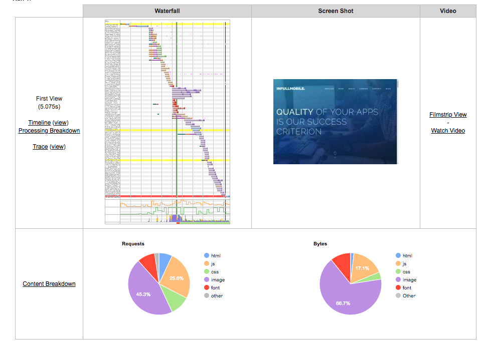

# inFullApi

---

## inFullApi

---

5+ seconds (not milliseconds!) load time on WebPageTest:

- First Byte Time: F grade
- Cache static content: F grade
- Effective use of CDN: No

<small>https://www.webpagetest.org/result/181121_86_dad9bcf684a911aee2353d6d98c463a1/</small>

3/100 score on testmysite.io:

- Slow TTFB (Time To First Byte)
- Slow loading HTML
- HTTP2 not enabled

<small>https://testmysite.io/5bf530f7e39e7c78ae0e09e4/infullmobile.com</small>

---

---

---

https://www.webpagetest.org/result/181121_WZ_b79026bbf061ef6b5b648bb8083e9dde/

---

HTML load time (no images and no rendering)

It is:

It should be:

<small>(it's a development version of BookVenyou)</small>

---

What can we do

How can we incrementally make it more 

https://www.filestack.com/

